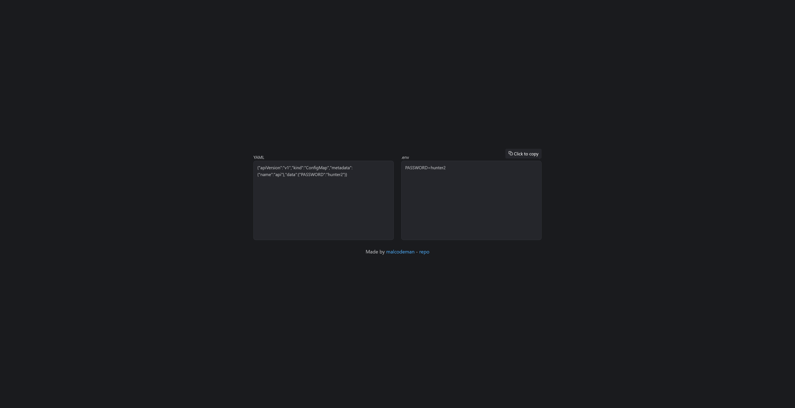

# [YAML 2 .env](https://yaml2env.surge.sh/)

[](https://github.com/prettier/prettier)
[](https://github.com/malcodeman/yaml-2-env/blob/master/LICENSE)

Simple YAML to .env convertor. Designed for Kubernetes [ConfigMaps](https://kubernetes.io/docs/concepts/configuration/configmap).



## Getting started

```
git clone https://github.com/malcodeman/yaml-2-env
cd yaml-2-env
npm install
npm run dev
```

## License

[MIT](./LICENSE)
