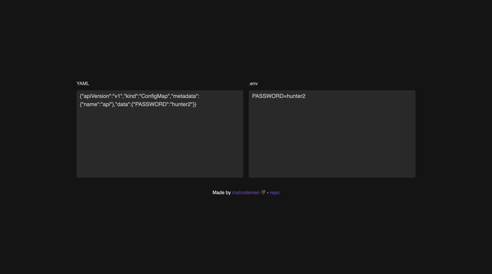

# [YAML 2 .env](http://yaml2env.surge.sh/)

[](https://github.com/styled-components/styled-components)
[](https://github.com/prettier/prettier)
[](https://github.com/malcodeman/apage-client/blob/master/LICENSE)

Simple YAML to .env convertor. Designed for Kubernetes ConfigMaps.



## Getting started

```
git clone https://github.com/malcodeman/yaml-2-env yaml-2-env
cd yaml-2-env
yarn install && yarn start
```

## License

[MIT](./LICENSE)
